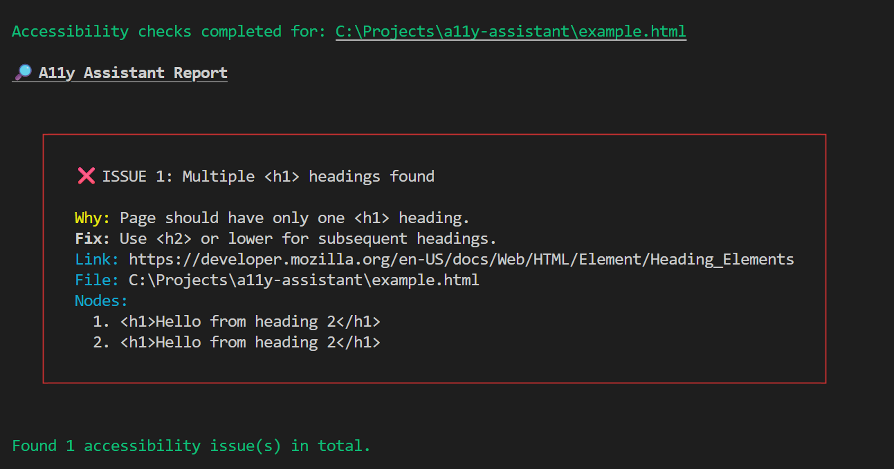

# A11y Assistant

A **tiny, educational accessibility CLI** that detects **common a11y issues** in your HTML or static builds and explains:

- **What the problem is**
- **Why it matters**
- **How to fix it** with code examples

Perfect for catching basic accessibility problems early. In your local development environment.

## 🚀 Features

- Checks for **common accessibility issues**, including:
  - Missing `alt` text on images
  - Form fields without labels
  - Skipped heading levels
- Educational output with **plain language explanations** and **suggested fixes**
- Runs locally
- Lightweight and fast (<1s on most projects)

## 📦 Installation

Install the package:

```bash
pnpm install
```

## 🛠 Usage
### Local Scan

Run against an HTML file:

```bash
tsx src/index.ts example.html
```

Example output:



## 📋 Roadmap
- Add tests
- More rules (links, colour contrast, ARIA patterns)
- Published to npm
- Inline PR comments for detected issues
- AI assistant layer to explain fixes in context, get the data from the WCAG
- VS Code extension for inline feedback

## 🤝 Contributing
PRs, ideas, and issues are welcome!

- Create a branch from main
- Run `pnpm install`
- Add or update a rule in `src/rules`
- check if the rules are working `pnpm dev`

Open a pull request with a clear description
